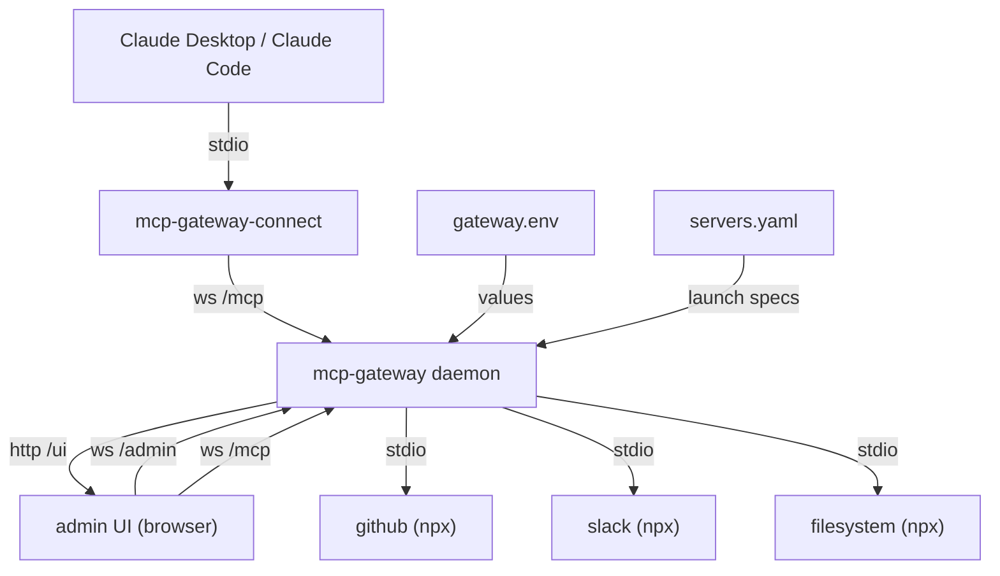
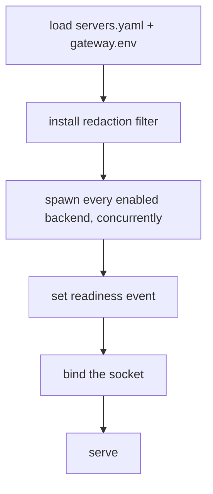
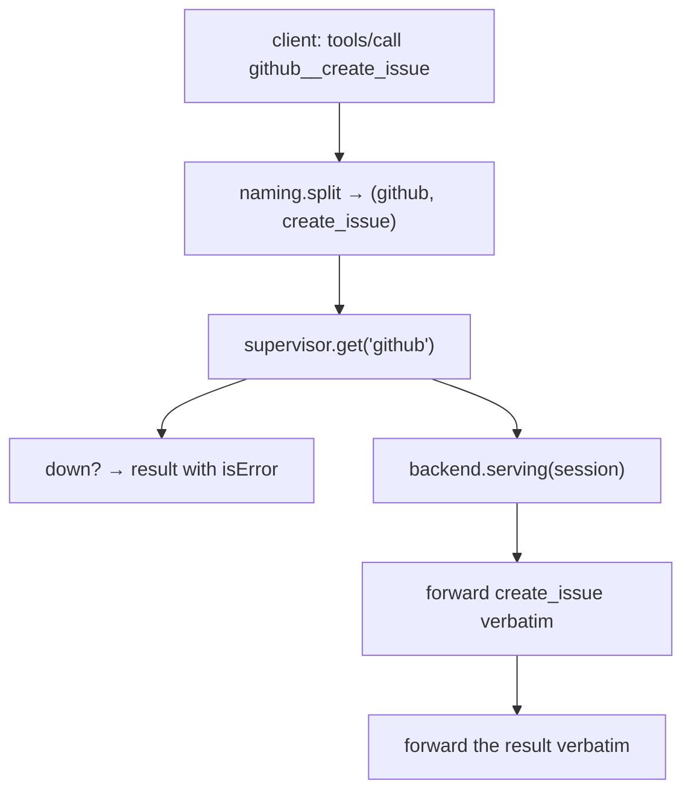
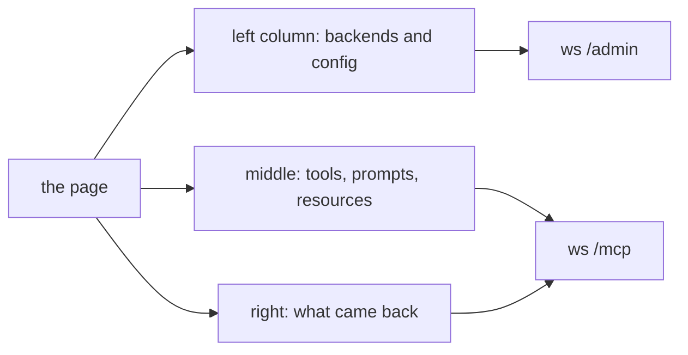

# Architecture

The gateway is a long-lived daemon. It serves **MCP over WebSocket** to any number of
clients, and fans out to N backend MCP servers, each a **stdio subprocess** whose lifecycle
it owns. Every credential lives in one gitignored file, and each backend receives only its
own. It also serves its own admin UI, as static files, on the same port.

## Subsystems

| Module | Owns |
|---|---|
| [`cli.py`](src/mcp_gateway/cli.md) | argparse, logging, signals, path resolution. The only module that touches `sys.argv` |
| [`transport_ws.py`](src/mcp_gateway/transport_ws.md) | the WS server: bind, path routing, access key, origin, keepalive |
| [`session.py`](src/mcp_gateway/session.md) | one `/mcp` connection's state and method table |
| [`admin_channel.py`](src/mcp_gateway/admin_channel.md) | one `/admin` connection: a plain JSON-RPC table for the UI |
| [`webui.py`](src/mcp_gateway/webui.md) | the admin UI's static assets, on `/ui` |
| [`bridge.py`](src/mcp_gateway/bridge.md) | `mcp-gateway-connect` — stdin↔WS pump |
| [`gateway.py`](src/mcp_gateway/gateway.md) | the composition root; everything shared |
| [`supervisor.py`](src/mcp_gateway/supervisor.md) | the shared backend pool, and reload |
| [`backend.py`](src/mcp_gateway/backend.md) | one backend's lifetime, and its curated environment |
| [`mcp_stdio.py`](src/mcp_gateway/mcp_stdio.md) | the MCP client over subprocess stdio |
| [`catalogue.py`](src/mcp_gateway/catalogue.md) | the merged, namespaced listing |
| [`router.py`](src/mcp_gateway/router.md) | forwards one call, translates what comes back |
| [`admin.py`](src/mcp_gateway/admin.md) | the `gateway__*` meta-tools, shared with `/admin` |
| [`notifications.py`](src/mcp_gateway/notifications.md) | backend→client relay, and its debounce |
| [`config.py`](src/mcp_gateway/config.md) | `servers.yaml` → specs. No secrets |
| [`config_writer.py`](src/mcp_gateway/config_writer.md) | the other direction: the only module that writes `servers.yaml` |
| [`secrets.py`](src/mcp_gateway/secrets.md) | `gateway.env` → values. The only module that holds one |
| [`logging_redaction.py`](src/mcp_gateway/logging_redaction.md) | scrubs known values from every log record |
| [`naming.py`](src/mcp_gateway/naming.md) | the `__` separator and the `mcpgw://` scheme |
| [`protocol.py`](src/mcp_gateway/protocol.md) | method names, versions, the capability block |
| [`errors.py`](src/mcp_gateway/errors.md) | exceptions → JSON-RPC errors, and the `source` tag |
| [`jsonrpc.py`](src/mcp_gateway/jsonrpc.md) | framing and classification, shared by all three transports |

## Startup

Backends come up **before** the socket binds. The first client to attach finds a warm pool,
a daemon with no clients can still answer `/admin` about what is running, and no client can
connect into a half-populated catalogue and cache an answer that was true for a second.

A backend that fails is skipped and logged; the daemon still serves. `required: true` opts
one server into making that fatal instead.

## A tool call

Routing is a **pure string split with no lookup table**, which is only unambiguous because a
server name may not contain `__`. That one coupling is what keeps a call correct after a
`list_changed` nobody has refetched yet, and it means a backend tool already named
`create__issue` works unmodified. See [`naming.md`](src/mcp_gateway/naming.md).

## Two things the design turns on

**A dead backend answers differently per method.** `tools/call` returns a *successful* result
carrying `isError: true`, because MCP's contract is that tool-level failure is a successful
result — so the model can read "GitHub is not configured" and tell the human, instead of the
turn dying on a protocol error it cannot act on. `prompts/get`, `resources/read` and
`completion/complete` have no such escape hatch and answer `-32603`, `-32002` and `-32603`.
See [`router.md`](src/mcp_gateway/router.md).

**Reload diffs on *resolved* spawn identity.** Comparing the `${VAR}` templates would make
rotating a token look like no change at all — and reloading after a rotation is the main
reason anyone reloads. An unchanged backend keeps its process, so adding one server does not
drop in-flight work on the other eleven. See [`supervisor.md`](src/mcp_gateway/supervisor.md).

## Security posture

| | |
|---|---|
| Backend env | built from nothing: allowlist + `env_passthrough` + own `env`. No backend sees another's credential |
| `${VAR}` | resolved from `gateway.env` only, **never** `os.environ` |
| `command`/`args` | interpolation refused — argv is world-readable through `ps` |
| Logging | every known value scrubbed at the **root** logger, so a backend's own stderr is covered too |
| Bind | non-loopback with no key is refused; `is_loopback` fails closed |
| Admin | no method returns a credential value; secret *writing* is not implemented anywhere. Config writing is on `/admin` only, where the model cannot reach it |
| Origin | a socket whose `Origin` header names anywhere but this server is refused: WS has no same-origin policy, and a browser is now a client |
| UI | static files only, and a CSP that forbids loading anything the page did not ship |

## The UI

`/ui` serves six static files -- HTML, CSS and three ES modules -- from the same port as the
two sockets. No build step and no dependency; `webui.py` answers the GET.

**The middle and right columns speak MCP, not `admin.*`.** A UI that asked `/admin` for a
tool listing would be showing its own rendering of the catalogue; the value of a test bench
is that what you exercise in it is byte-identical to what the model gets. `/admin` answers
what is *configured* -- and, since the UI landed, writes it.

The form in the middle column is generated from each tool's own `inputSchema`, following the
contract in python-acp's `docs/tool-schema-contract.md`: a schema using `if`/`then`/`else`,
`dependentSchemas`, `allOf` or a discriminated `oneOf` steps aside to a raw JSON box with a
reason rather than rendering half a conditional schema as though it were the whole thing.
`examples/zoo_server.py` publishes one tool per construct, which is what that code is
answerable to. See [`webui.md`](src/mcp_gateway/webui.md).

## Notes

Every module has a sibling `.md` next to it, and `make docs-check` fails if one is missing or
if a relative link does not resolve. The reasoning lives there; this file is the map.
