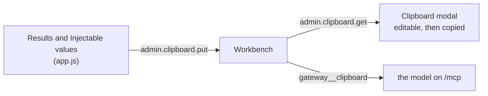

# `clipboard.py`

The bench session, written out for a model to read.

A person drives the admin UI by hand — press Send, read the answer, pick a value, press Send
again. What comes out of that is a small body of evidence about a backend, and it used to be
locked in the page: the results are DOM nodes in the middle column, the picks are a `Map` in
`app.js`. This module is the document that carries both out.

## One renderer, two surfaces

The same pattern as the meta-tools in [`admin.md`](admin.md), for the same reason.

| Surface | Method | Who reads it |
|---|---|---|
| Clipboard modal | `admin.clipboard.get` on `/admin` | a person, who may edit before copying |
| `gateway__clipboard` | `tools/call` on `/mcp` | the model, unedited |

Both call `Workbench.document()`. There is deliberately no second renderer in JavaScript:
two renderers of one document drift, and the drift would surface as the agent being told
something subtly different from what the person copied out of the modal.

## Why the page publishes data, not prose

The page has the state; the gateway has the model attached to it. So `app.js` posts a
**snapshot** — results and picks as data — with `admin.clipboard.put`, and this module is
the only thing that turns a snapshot into text.

The page publishes on a debounce whenever either column changes, rather than only when the
modal opens. That is what makes the tool worth having: a model that asks *"what has this
person been doing at the bench"* gets the current session, not the state as of the last time
somebody happened to press a button.

There is exactly **one** snapshot, process-wide, and it is not per connection — the whole
point is that the model on `/mcp` reads what the person did on `/admin`, and those are two
different sockets. It is also *not* persisted: it is a view of a live page, and a briefing
restored from disk after a restart would describe backends that are no longer running.

## Staleness is stated, never implied

`Workbench` records when a snapshot arrived, and the preamble says both the absolute
timestamp and the age in words. A model reading a four-hour-old capture has to be able to
tell it from a live one, and leaving that arithmetic to the reader is how a stale briefing
gets treated as current.

## The two rules in the document itself

**Backend output is quoted, never adopted.** Everything under Results came off a backend
this gateway launched, and a model reading it is one prompt injection away from taking a
tool result as an instruction. The preamble says so in as many words, and every payload is
fenced — with four backticks, because a backend that answers in Markdown puts three-backtick
blocks inside this one and a three-backtick fence would end at the first of them.

**Nothing is silently dropped.** `MAX_PAYLOAD_CHARS`, `MAX_RESULTS` and `MAX_VALUES` all cut
with a note that says what was cut and how much there was. A briefing that quietly loses
half a session is worse than no briefing, because nothing in the text says it happened.

## What is deliberately not here

**No write path.** The modal's editor is the person's own copy; editing it changes the text
in the textarea and nothing else. There is no `admin.clipboard.set`, and the tool takes no
argument that alters what it returns — an agent may read the bench, it may not rewrite what
the next reader sees.

**No secrets exception.** This module quotes what a backend returned, which is a payload the
same client could have fetched itself through `/mcp`; it never reads the credential store.
The line that `admin.md` draws around `gateway.env` is untouched here.
