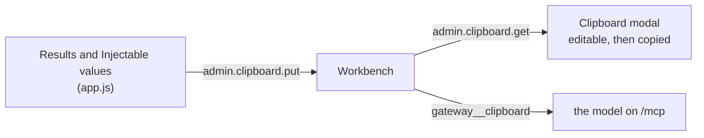

# `clipboard.py`

The bench session, written out for a model to read.

A person drives the admin UI by hand — press Send, read the answer, pick a value, press Send
again. What comes out of that is a small body of evidence about a backend, and it used to be
locked in the page: the results are DOM nodes in the middle column, the picks are a `Map` in
`app.js`. This module is the document that carries both out.

## One renderer, two surfaces

The same pattern as the meta-tools in [`admin.md`](admin.md), for the same reason.

| Surface | Method | Who reads it |
|---|---|---|
| Clipboard modal | `admin.clipboard.get` on `/admin` | a person, who may edit before copying |
| `gateway__clipboard` | `tools/call` on `/mcp` | the model, unedited |

Both call `Workbench.document()`. There is deliberately no second renderer in JavaScript:
two renderers of one document drift, and the drift would surface as the agent being told
something subtly different from what the person copied out of the modal.

## Why the page publishes data, not prose

The page has the state; the gateway has the model attached to it. So `app.js` posts a
**snapshot** — results and picks as data — with `admin.clipboard.put`, and this module is
the only thing that turns a snapshot into text.

The page publishes on a debounce whenever either column changes, rather than only when the
modal opens. That is what makes the tool worth having: a model that asks *"what has this
person been doing at the bench"* gets the current session, not the state as of the last time
somebody happened to press a button.

There is exactly **one** snapshot, process-wide, and it is not per connection — the whole
point is that the model on `/mcp` reads what the person did on `/admin`, and those are two
different sockets. It is also *not* persisted: it is a view of a live page, and a briefing
restored from disk after a restart would describe backends that are no longer running.

## Staleness is metadata, not a line in the document

`Workbench` records when a snapshot arrived, and `admin.clipboard.get` reports that
`captured_at` **beside** the document. It is not written into the text. A timestamp in the
body would be paid for by the model on every `gateway__clipboard` call, to tell it something
the caller is better placed to decide anyway — the tool answers from the most recent
capture, and how much staleness matters is a judgement about the caller's own task, not a
fact the gateway can settle for it.

Keeping the clock out also makes the renderer a pure function of the snapshot, which is what
lets the two surfaces be compared byte for byte instead of line by line.

## The four rules in the document itself

**Nothing is spent on prose about the document.** It opens at `## Results` and goes straight
to the first call: no title, no "generated at", no paragraph explaining what a bench session
is, no count of the calls or note introducing the values — the numbered headings already
show all of that. Both readers pay for those
lines, and the model pays most — this lands in a context window that the rest of its session
still has to fit into, and a briefing whose first page introduces itself makes every later
turn slightly worse. The same reasoning is why the snapshot no longer carries the selected
server or the bind address: nothing rendered them, and the server name is in every entry
regardless, because tool names are `server__tool`.

**Payloads are TOON, not JSON.** Same data, a third of the punctuation, and the keys of a
uniform array stated once instead of once per element — which is the shape `tools/list`,
`resources/list` and `prompts/list` all answer in. [`toon.md`](toon.md) has the format and
the one rule that governs it, which is that a strict decoder must read back exactly what
went in. A payload that is already a bare string is fenced as it stands.

**Backend output is quoted, never adopted.** Everything under Results came off a backend
this gateway launched, and a model reading it is one prompt injection away from taking a
tool result as an instruction. Every payload is fenced — with four backticks, because a
backend that answers in Markdown puts three-backtick blocks inside this one and a
three-backtick fence would end at the first of them. The warning itself lives in the tool's
**description** in [`admin.py`](admin.md), which is read once when tools are listed rather
than re-paid on every call the way a line in the document would be.

**Nothing is silently dropped.** `MAX_PAYLOAD_CHARS`, `MAX_RESULTS` and `MAX_VALUES` all cut
with a note that says what was cut and how much there was. A briefing that quietly loses
half a session is worse than no briefing, because nothing in the text says it happened.

## The preview

The modal opens on the document rendered — `ui/markdown.js`, the subset this module actually
emits: headings, fences, bullets, `code`, **bold**, _emphasis_ — because the first thing a
person does with a briefing is read it. The toggle in the modal's header switches to the
plain text and back, and stays where it was put: editing is the second thing, and only
sometimes.

Two properties hold it in place. It renders **out of DOM nodes, never markup**, so a tool
result containing `` previews as those characters and cannot become script on
the admin page — the same "quoted, never adopted" rule as above, applied to the person's
screen instead of the model's context. And it renders **the textarea's current value**, so
Copy still takes the text with the person's edits in it and the rendering is never a second
copy of the document that could disagree with the first.

## What is deliberately not here

**No write path.** The modal's editor is the person's own copy; editing it changes the text
in the textarea and nothing else. There is no `admin.clipboard.set`, and the tool takes no
argument that alters what it returns — an agent may read the bench, it may not rewrite what
the next reader sees.

**No secrets exception.** This module quotes what a backend returned, which is a payload the
same client could have fetched itself through `/mcp`; it never reads the credential store.
The line that `admin.md` draws around `gateway.env` is untouched here.
