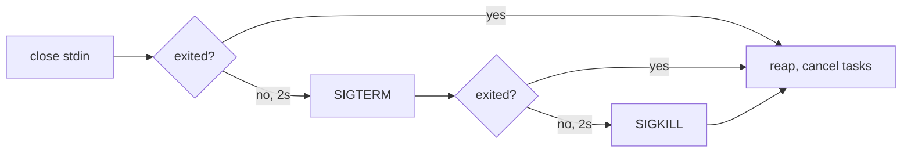

# mcp_stdio.py

## Purpose

`mcp_stdio.py` manages communication with an MCP server process over stdio using JSON-RPC payloads.

MCP is bidirectional. The server may send requests and notifications of its own at
any time, not only responses to ours, so this module reads stdout continuously
rather than only while one of our requests is in flight.

## The session and the transport

Two classes. `MCPClient` is the MCP session: ids, pending futures, the handshake, capability
checks, pagination, cancellation, and answering server requests. It knows nothing about
bytes. `MCPStdioClient` is one transport under it, a subprocess's stdin and stdout, and
`MCPHttpClient` in [`mcp_http.py`](mcp_http.md) is the other. A transport supplies `start`,
`stop` and `_write`, and passes every message it reads to `_handle_message`.

The split is what let HTTP backends ship without a second copy of anything in this file.
The rules below about cancellation, server requests and version negotiation are MCP rules,
not stdio ones, and a copy is how the two transports would end up disagreeing about them.
Where the headings below say `MCPStdioClient`, everything outside the process sections
("Shutdown Sequence", "stderr Draining", "Stream Limit", `env`) now lives on `MCPClient`.

## Key Responsibilities

- Spawn the MCP subprocess and shut it down in the order the transport prescribes.
- Negotiate the MCP protocol version at `initialize`, and disconnect rather
  than proceed when the server answers with a revision this client cannot speak.
- Continuously drain the subprocess's stderr.
- Serialize request and notification messages to JSON lines.
- Read every stdout message and route it by shape: response, server request, or notification.
- Answer server-initiated requests, including with an error.
- Un-ask a request this client stops waiting for, so the server is not left
  computing a reply nobody will read.
- Expose convenience methods for tools, prompts, and resources.
- Walk cursor-paginated list results to exhaustion instead of returning page one.
- Preserve the server's JSON-RPC error code on the raised exception, and keep a
  failed tool call distinct from a failed request.

## Main Symbols

- `MCPProtocolError`: protocol/runtime error type for MCP communication failures.
  Carries `code` and `data` from the server's JSON-RPC error response, or `None`
  for both when this client raised the failure itself.
- `MCPProtocolError.from_error_response()`: builds one from a JSON-RPC `error` member.
- `MCPStdioClient.call_tool()`: invokes a tool; validates the result shape and
  normalizes the optional `isError` flag.
- `MCPStdioClient.start()` / `stop()`: subprocess and background task lifecycle.
- `MCPStdioClient._shutdown_process()`: the close-stdin / SIGTERM / SIGKILL escalation.
- `MCPStdioClient.initialize()`: sends MCP `initialize`, checks the version the
  server answered with, and only then sends `notifications/initialized`.
- `MCPStdioClient.protocol_version`: the revision both sides settled on, or
  `None` before a successful handshake.
- `MCPStdioClient.server_capabilities`: the block the server declared, kept from the
  `initialize` result. `None` before the handshake and `{}` for a server that declared
  nothing — two different facts, which is why the default is not `{}`.
- `MCPStdioClient.supports(capability)`: whether the server declared it. **Presence** is
  the whole test, and it answers `True` before the handshake — see "Server Capabilities".
- `MCPStdioClient._agreed_protocol_version()`: validates the server's answer
  against `_SUPPORTED_MCP_PROTOCOL_VERSIONS` or raises `MCPProtocolError`.
- `_MCP_PROTOCOL_VERSION` / `_SUPPORTED_MCP_PROTOCOL_VERSIONS`: the revision
  proposed, and the set that may be accepted in reply.
- `MCPClientCapabilities`: the frozen block `initialize` promises. `roots`,
  `roots_list_changed`, `elicitation` — and deliberately no `sampling` field.
- `UnsupportedServerRequest` / `MalformedServerRequest`: the two things an
  `on_server_request` handler can say other than "here is your result" — `-32601`
  "we never offered this", and `-32602` "you sent that badly". Everything else it
  raises is `-32603`, which says *we* broke.
- `MCPStdioClient.client_capabilities`: what this client will declare. Empty by
  default.
- `MCPStdioClient._declared_capabilities()`: builds the block and refuses to send
  a non-empty one with no `on_server_request` handler behind it.
- `UnsupportedServerRequest`: raised by a handler for a method it does not serve;
  becomes `-32601` rather than `-32603`.
- `MCPStdioClient.request()`: sends a request and awaits its correlated reply.
- `MCPStdioClient.notify()`: sends a notification without expecting a response.
- `MCPStdioClient.cancel_request()`: sends `notifications/cancelled` for a
  request whose answer this client abandoned. Best-effort and never raises.
- `MCPStdioClient._abandon()`: forget one pending request and tell the server to
  stop working on it — the shared path for a timeout and for a cancelled caller.
- `MCPStdioClient.list_tools()` / `list_prompts()` / `list_resources()` /
  `list_resource_templates()`: fully paginated list wrappers, each returning the
  accumulated items across all pages.
- `MCPStdioClient.list_resource_templates()`: `resources/templates/list`, the *other*
  half of the resources primitive. A URI template (`greeting://{name}`) is published
  here and nowhere else, under `resourceTemplates` and as `uriTemplate` rather than
  `uri`, so a caller that asks only `list_resources()` reports a server whose resources
  are all templates as having none. Same `resources` capability; templates
  are optional within it, so a `-32601` here is conforming and the caller decides
  whether to absorb it.
- `MCPStdioClient._list_all()`: the shared `nextCursor` walk behind those four.
- `MCPStdioClient.read_resource(uri)`: `resources/read` for one concrete URI. Takes
  no `arguments` -- a templated resource is expanded client-side into a concrete
  URI before this is called, so the substitution never reaches the wire.
- `MCPStdioClient._MAX_LIST_PAGES`: hard ceiling on pages walked in one list call.
- `MCPStdioClient._read_loop()`: background task consuming all stdout messages.
- `MCPStdioClient._handle_message()`: routes one inbound message by shape.
- `MCPStdioClient._drain_stderr()`: background task consuming the subprocess's stderr.
- `on_server_request` / `on_notification`: optional async hooks for inbound server traffic.

## Message Routing

Every inbound message is classified by whether it carries `method` and `id`:

| `method` | `id` | Treated as | Handling |
|---|---|---|---|
| absent | present | response to our request | resolves the pending future for that id |
| present | absent | server notification | passed to `on_notification`, if set |
| present | present | server-initiated request | answered — see below |

```mermaid
sequenceDiagram
    participant Caller
    participant Client as MCPStdioClient
    participant Loop as _read_loop
    participant Proc as MCP Server Process

    Note over Loop,Proc: read loop runs for the life of the subprocess

    Caller->>Client: request(method, params)
    Client->>Client: allocate id, register pending future
    Client->>Proc: write JSON-RPC line with id
    Proc-->>Loop: stdout line
    alt response to our id
        Loop->>Client: resolve pending future
        Client-->>Caller: result dict or MCPProtocolError
    else server-initiated request
        Loop->>Loop: spawn a task; keep reading
        Note over Loop: the handler may wait on a human
        Loop->>Proc: write reply, when the task finishes
    else notification
        Loop->>Loop: on_notification, if set
    end

    opt abandoned: no reply within request_timeout, or the caller was cancelled
        Client->>Proc: notifications/cancelled {requestId}
        Client-->>Caller: MCPProtocolError, or the CancelledError re-raised
    end
```

## Answering Server Requests

Every server request gets a reply. Leaving one unanswered strands the server
waiting on us — the failure this design exists to prevent.

- `ping` is answered inline with `{}`. It is protocol plumbing, not application logic.
- Anything else goes to `on_server_request` when one is set; its return value
  becomes the `result`.
- With no handler set, the reply is `-32601` naming the method.
- A handler that raises `UnsupportedServerRequest` also produces `-32601` — the
  same answer, because it means the same thing.
- A handler that raises `MalformedServerRequest` produces `-32602`: the server
  used a capability we really do declare, with params we cannot read.
- A handler that raises anything else produces `-32603` carrying the exception
  text; the read loop keeps running.

**The read loop answers nothing itself.** Each server request is dispatched into a
task of its own, because a handler may take arbitrarily long — `elicitation/create`
is forwarded to the gateway's own client and waits on a person — and a loop awaiting one would
stop reading everything else on the connection, including the response to the very
call that provoked the request. Replies may therefore leave out of arrival order,
which JSON-RPC allows: the id is what matches them. `stop()` cancels whatever is
still in flight before the subprocess goes, and tells the server nothing, because a
reply written into a closing stdin is no better than silence.

**Why the two error codes are not interchangeable.** `-32603` says *we broke*;
`-32601` says *we never offered this*. One callable stands behind every declared
capability, so a handler wired up for `roots/list` is also the thing a server's
`sampling/createMessage` reaches. Collapsing that into `-32603` would tell the
server its request failed when the truth is that it was never on offer, and the
distinction is what makes the capability block above mean anything on the wire.

`on_server_request` is where the gateway's reverse passthrough hooks in. `gateway.py`
installs one per backend, and it forwards the three requests in
`protocol.RELAYED_SERVER_REQUESTS` — `roots/list`, `sampling/createMessage`,
`elicitation/create` — **up** to a client connection, returning that client's answer
verbatim. Anything else raises `UnsupportedServerRequest`, which becomes the `-32601` the
paragraph above describes.

Which connection, in a daemon holding several, is the interesting part and is decided in
`gateway.py`, not here: the request goes to the connection whose call is currently in
flight, tracked by a `contextvars.ContextVar` set in `router.py`. A *spontaneous* backend
request — one arriving with no call in flight — also gets `-32601`, because there is no
honest way to choose whose human to interrupt.

## Client Capabilities

A capability block is a **promise**. MCP says a server MUST NOT use a capability
the client did not declare, and by symmetry a client that declares one must be
able to answer it. Both failure modes are real and neither is loud:

| Mistake | What the server does |
|---|---|
| declare nothing (`{}`) | never sends `roots/list`, `elicitation/create`, or anything else, so the handler is dead code |
| declare what nothing answers | sends the request and gets a `-32601` it was told would not happen |

So `initialize` refuses the second one before it reaches the wire:
`_declared_capabilities()` raises `RuntimeError` when the block is non-empty and
`on_server_request` is `None`. That is a conformance bug in *this* process, not
a bad input, which is why it is a `RuntimeError` and not an `MCPProtocolError`.
The check is presence, not coverage — nothing here can tell which methods a
single callable actually handles, which is what `UnsupportedServerRequest` is
for.

| Field | Wire | Answered by |
|---|---|---|
| `roots` | `"roots": {"listChanged": <bool>}` | `gateway.py`, by forwarding `roots/list` to a client connection |
| `roots_list_changed` | the `listChanged` flag | nothing — `false` today |
| `elicitation` | `"elicitation": {}` | `gateway.py`, by forwarding the question up and handing the answer back |

An undeclared capability contributes **no key at all**, not a `false`: in MCP,
absent means unsupported.

**What the gateway puts in this block is not a constant.** It is the union of what the
currently-attached clients declared, recomputed on connect and disconnect. A backend
cannot renegotiate after `initialize`, so the union is the only honest answer at the
moment a backend starts — and the origin-connection routing rule above is what ensures a
request we accepted can always be placed. See [`protocol.md`](protocol.md).

A gateway with no clients attached declares nothing, which is correct: there is nobody to
ask.

## Server Capabilities

The same promise, pointing the other way: a client MUST NOT use a capability the
*server* did not declare. So `initialize` keeps the block instead of reading the
protocol version out of the result and dropping the rest.

| Server capability | Unlocks |
|---|---|
| `tools` | `tools/list`, `tools/call` |
| `prompts` | `prompts/list`, `prompts/get` |
| `resources` | `resources/list`, `resources/read`, `resources/templates/list` |
| `resources.subscribe` | `resources/subscribe`, `resources/unsubscribe` |
| `logging` | `logging/setLevel`, and `notifications/message` coming back |
| `completions` | `completion/complete` |

`resources.subscribe` is the one row read with `supports_option` rather than `supports`:
presence is not enough, because these are booleans *inside* an option block and
`"resources": {}` means resources without subscriptions. Everywhere else presence is the
whole test — see `supports`.

`complete()` is the wrapper, beside `read_resource()`. It omits `context` rather than
sending it as `null` — presence is meaningful in MCP, and a `null` where an object is
expected is the sort of thing a strict validator refuses and a lenient one ignores. Whether
`context` may be sent at all is the *caller's* decision, because it postdates `2024-11-05`
and this module does not know what was negotiated; `router.py` makes that call.

`supports(capability)` is what reads it, and two of its rules are load-bearing:

- **Presence, not truthiness.** MCP capability values are option blocks, and
  `"prompts": {}` — the commonest form there is — means the feature is present with no
  options to set. `bool(block)` would read it as unsupported.
- **`True` before the handshake**, when `server_capabilities` is still `None`. The honest
  answer to "may I call this" is not "no": a caller reaching a method before `initialize`
  has a worse problem than a capability check can describe, and refusing here would
  replace its real error with a misleading one.

Nothing in this module enforces the check — it is a fact the caller reads.
`catalogue.py` is the caller, and what it buys is the
quality of the refusal: asked anyway, a server without prompts answers `-32601`, and
`errors.py` faithfully forwards that as a JSON-RPC error naming a method the person never
typed. It also separates two things an empty listing cannot: a server that publishes no
prompts from one that does not implement prompts at all.

## Protocol Version Negotiation

The handshake settles on a version; it does not assume one. The client proposes
`_MCP_PROTOCOL_VERSION` (`2025-06-18`) and the server replies with the revision
it will actually use — which need not be the one proposed. A server that cannot
speak the proposal MUST counter with one it supports, and a client that cannot
speak the counter MUST hang up rather than carry on.

That is why `initialize()` calls `stop()` before re-raising: proceeding on a
version mismatch produces failures later that look unrelated to the handshake,
which is the bug this check exists to prevent. `notifications/initialized` is
never sent on the rejection path — half a handshake strands the server.

| Server answer | Result |
|---|---|
| a version in `_SUPPORTED_MCP_PROTOCOL_VERSIONS` | recorded in `protocol_version`, handshake completes |
| any other version | `MCPProtocolError: Unsupported MCP protocol version <v> from server`, subprocess stopped |
| `protocolVersion` absent, empty, or not a string | `MCPProtocolError: MCP initialize result omitted protocolVersion`, subprocess stopped |

**Proposed and accepted are two different sets, and that is the point.** We
propose `2025-06-18` and accept either it or `2024-11-05`:

| | Revision | Why |
|---|---|---|
| proposed | `2025-06-18` | `elicitation` — the client capability the gateway forwards upward — does not exist before it |
| also accepted | `2024-11-05` | a server pinned there must counter with it, and hanging up on that counter would drop every server that has not moved yet |

Nothing in this module changed to make the bump: the framing, the handshake, and
the shutdown sequence are identical across the two, the result fields
`2025-06-18` adds (`structuredContent`, resource links) are passed through
untouched, and JSON-RPC batching — the one thing it removes — was never used
here. Every method this client calls exists in both. Only `elicitation/create`
is newer, and a server that countered with `2024-11-05` will never send one —
which loses nothing, because it is the *server* that would have asked.

Widening the accepted set further is a claim that this client can speak that
revision; read
the spec's own revision notes first,
since `2026-07-28` replaces the handshake outright.

`_MCP_PROTOCOL_VERSION` is an MCP revision date. It is unrelated to
the constants in [`protocol.py`](protocol.md), which is where they now live and an
integer. Two protocols, two version fields; do not unify them.

The mock server negotiates for real — by default it echoes back whatever was
proposed, which is what a supporting server does:

| Env var | Effect |
|---|---|
| (none) | echo the proposed `protocolVersion` back |
| `MOCK_MCP_PROTOCOL_VERSION=<v>` | answer with `<v>` regardless of the proposal (the counter-offer path) |
| `MOCK_MCP_OMIT_PROTOCOL_VERSION=1` | omit `protocolVersion` from the result entirely |

It also records the `initialize` params exactly as they arrived and hands them
back through the `handshake-report` tool. A test that wants to check the
capability block should read it there rather than off the client attribute: what
a promise says is what reached the server.

## List Pagination

MCP list results are cursor-paginated. A result carries `nextCursor` when more
pages exist; the client re-issues the same method with `cursor` set to that
value and keeps going. `_list_all()` implements the walk once, and all three
list wrappers delegate to it.

Two rules that are easy to get wrong:

- **An absent `nextCursor` is the only terminator.** A page carrying zero items
  is legal mid-walk and does not mean the list ended. `MOCK_MCP_LIST_EMPTY_MIDDLE=1`
  in the mock server reproduces exactly that shape.
- **The first request omits `cursor` entirely.** It does not send `null`.

The walk is driven entirely by the server, so a broken or hostile one could keep
issuing cursors forever. It is bounded twice, and both bounds raise
`MCPProtocolError` rather than hanging the bridge:

| Condition | Result |
|---|---|
| `nextCursor` absent | walk ends, accumulated items returned |
| `nextCursor` repeats one already seen | `MCPProtocolError: <method> repeated cursor '<c>'` |
| more than `_MAX_LIST_PAGES` (100) pages | `MCPProtocolError: <method> exceeded 100 pages` |
| `nextCursor` present but not a non-empty string | `MCPProtocolError: Invalid nextCursor in <method> response` |
| the page key holds a non-list | `MCPProtocolError: Invalid <method> response` |

The mock server at `tests/fixtures/mock_mcp_server.py` serves paginated lists on
demand, so these paths are tested against a real subprocess:

| Env var | Effect |
|---|---|
| `MOCK_MCP_LIST_PAGES=N` | serve N pages; `nextCursor` is absent on the last (default 1) |
| `MOCK_MCP_LIST_STUCK=1` | hand back the same `nextCursor` forever |
| `MOCK_MCP_LIST_EMPTY_MIDDLE=1` | page 0 has no items but does carry a `nextCursor` |

## Two Kinds of Tool Failure

MCP distinguishes a request that failed from a tool that failed, and the two must
not collapse into one another.

| | Wire shape | Raised as | Meaning |
|---|---|---|---|
| **Request failed** | JSON-RPC `error` response | `MCPProtocolError` with `code` set | The call never ran: unknown tool, invalid arguments, server fault |
| **Tool failed** | JSON-RPC `result` with `isError: true` | nothing — returned normally | The call ran and reported failure; `content` explains why |

`call_tool()` therefore raises for the first and returns for the second. Treating
`isError` as an exception would discard the content explaining the failure and
would make a misbehaving tool indistinguishable from an unreachable backend.

`isError` is optional on the wire and defaults to false. `call_tool()` fills it in
so callers can read `result["isError"]` unconditionally, and rejects a non-boolean
`isError` or a non-list `content` as `MCPProtocolError` — a broken server, not a
tool failure.

## Error Codes Are Preserved

A JSON-RPC error response is parsed rather than stringified:

```python
raise MCPProtocolError.from_error_response(error)
# -> MCPProtocolError("MCP error -32601: Unknown tool", code=-32601, data=None)
```

`code` and `data` are `None` whenever the failure originated here rather than at
the server — a timeout, a dead read loop, a stopped process, a malformed result, a
runaway pagination walk. Callers use that as the signal for whether a code is
theirs to forward; `errors.py` forwards a real code and falls back to `-32603`
when there is none. A server that sends a non-integer `code` is treated as having
sent none, so junk never reaches the client-facing wire.

The mock server exposes both failure kinds through dedicated tool names:

| `tools/call` name | Behavior |
|---|---|
| `boom` | successful result with `isError: true`; `arguments.detail` sets the text |
| `no-flag` | successful result that omits `isError` entirely |
| `rpc-error` | JSON-RPC error response; `arguments.code` / `message` / `data` set the members |

These are argument-driven rather than env-driven so one client can exercise a tool
failure and a request failure in the same test, the way `provoke` already works.

## Cancelling an Abandoned Request

JSON-RPC has no in-band cancel. A request this client stops waiting for is
therefore still live on the server, which keeps computing a reply nobody will
read — and, on a stdio server that works serially, keeps every later request
queued behind it. MCP's remedy is the `notifications/cancelled` notification:

```json
{"jsonrpc": "2.0", "method": "notifications/cancelled",
 "params": {"requestId": 7, "reason": "mcp-gateway timed out after 30.0s waiting for tools/call"}}
```

`cancel_request(request_id, reason=None)` is that whole path, deliberately kept
as one method rather than as a branch inside the timeout handler: cancelling for
any other reason is the same call with different `reason` text. `reason` is
optional and is omitted from the params when empty.

Three properties it is worth not re-deriving:

| Property | Why |
|---|---|
| It never raises | A dead subprocess has nothing left to cancel, and a failed courtesy must not mask the failure that prompted it. This covers `OSError` as well as `MCPProtocolError` — see below |
| It does not touch `_pending` | Whoever abandoned the request owns that future; this only puts the notification on the wire |
| A late reply is still tolerated | The notification and a real response can cross in flight; `_resolve_response` discards a response for a forgotten id |

**Both error families are swallowed, not just `MCPProtocolError`.** The
`stdin.is_closing()` guard in `_write()` catches a subprocess that is already
gone, but not one that dies *during* `drain()` — that window surfaces as
`BrokenPipeError`/`ConnectionResetError`. Letting one escape would replace the
`MCPProtocolError` the timeout path is about to raise with an unrelated
`OSError`, so `cancel_request` catches `(MCPProtocolError, OSError)` and logs at
debug. `test_timeout_still_raises_mcp_error_when_cancelling_breaks` pins the
outcome that matters: the caller still sees the timeout.

**`initialize` is the exception.** A client MUST NOT cancel the handshake, so
`_abandon()` skips the notification for that one method: there is no session for
the server to abandon yet, and the lifecycle defines no state after a cancelled
handshake. The timeout itself still raises.

### Two ways to stop waiting, one remedy

A timeout is not the only way a request is abandoned. When a client `notifications/cancelled`
tears down a turn, the `asyncio.CancelledError` lands on whatever `tools/call`
that turn was awaiting — and leaves the server in **exactly** the state a timeout
does. `request()` therefore catches both and routes them through `_abandon()`,
which forgets the pending future, skips `initialize`, and sends the notification
with reason text naming which of the two happened.

| Caller | What it sees | What the server gets |
|---|---|---|
| Timed out | `MCPProtocolError("Timed out waiting for …")` | `notifications/cancelled`, reason "timed out after Ns" |
| Cancelled | `asyncio.CancelledError`, **re-raised** | `notifications/cancelled`, reason "the caller was cancelled" |

The cancellation is re-raised rather than converted: returning a value from a
cancelled coroutine would tell asyncio the cancellation did not take, and
`agent.py` reads `Task.cancelled()` to answer `stopReason: "cancelled"`.

The notification goes out under `asyncio.shield`, because that branch runs
*inside* an `except asyncio.CancelledError` handler: if a second cancellation
lands while the write is in flight, the shielded write still completes and the
cancellation still reaches us at the `await`. Since `cancel_request` never
raises, nothing else can escape from there.

The mock server makes both halves observable against a real subprocess rather
than a spy — a request it accepts and never answers, and a report of what it
received:

| Knob | Effect |
|---|---|
| `tools/call` name `stall` | read the request, never answer it, record its id |
| `tools/call` name `cancel-report` | return `{"stalled": [...], "cancelled": [...]}` as JSON text |
| `MOCK_MCP_STALL_INITIALIZE=1` | stall the handshake too, so the never-cancel-initialize rule is testable |

`tests/test_agent.py::test_cancelling_mid_tool_call_answers_cancelled_and_unasks_the_backend`
drives the same three knobs from the client side: a call to `stall`, a
`session/cancel`, and a `cancel-report` proving the notification carried that
call's own request id.

## Concurrency Model

- A write lock covers request-id allocation and the write only. Waiting for a
  reply happens outside it, so concurrent requests pipeline instead of queueing
  behind one another.
- Replies are correlated by id through a pending-future map, not by position.
- `start()` spawns two background tasks — the stdout read loop and the stderr
  drain — both cancelled and awaited by `stop()`.

## Shutdown Sequence

The MCP stdio transport prescribes how a client shuts its server down, and
`stop()` follows it in order:

1. **Close the server's stdin.** A conforming MCP server exits when its stdin
   reaches EOF — that is the contract servers are written against.
2. **Wait for it to exit** (`_STOP_STDIN_TIMEOUT`, 2s).
3. **`SIGTERM`** if it is still running, then wait again
   (`_STOP_TERMINATE_TIMEOUT`, 2s).
4. **`SIGKILL`**, and wait unconditionally.



Starting at `SIGTERM` — as this module did before — signals every server that
would have shut down cleanly on EOF, denying it the chance to flush state or
run its own teardown. Each step is skipped when the process is already gone,
and `ProcessLookupError` from a process reaped between the check and the signal
is tolerated.

The stdout read loop and stderr drain are cancelled **after** the process has
exited, not before, so anything the server writes on its way out is still
consumed. Once stdin is closed, `_write()` raises `MCPProtocolError` rather
than writing into a closing transport.

## stderr Draining

stderr is piped, and a piped stream nothing reads will fill its OS buffer — at
which point the server blocks mid-write and stops reading stdin, deadlocking
every pending request. `_drain_stderr()` runs for the life of the subprocess to
prevent that, logging what it reads at debug level so the CLI's `--debug` flag
surfaces server-side output.

It reads with `StreamReader.read()` rather than `readline()` on purpose:
`readline()` raises on any line longer than the reader's limit, and one
over-long line would abort the drain and reintroduce the deadlock. Lines are
reassembled from fixed-size chunks instead, and an over-long line is flushed
rather than buffered without bound.

Draining is best-effort: unexpected errors stop the task quietly instead of
propagating into the client.

## Stream Limit

The subprocess is created with `limit=8 MiB` rather than asyncio's 64 KiB
default. A large `resources/read` response can exceed 64 KiB, and `readline()`
in the stdout loop would raise on it.

## Failure Modes

- Timeout waiting for a response raises `MCPProtocolError` and sends
  `notifications/cancelled` for the abandoned request — except for
  `initialize`, which MUST NOT be cancelled. If that notification cannot be
  written (including a `BrokenPipeError` mid-`drain()`), the failure is logged
  and the original timeout error still reaches the caller.
- A **cancelled caller** takes the same path and re-raises the
  `asyncio.CancelledError`, so a client's `notifications/cancelled` un-asks the in-flight MCP
  call instead of merely walking away from it.
- Closed stdout, a failed read loop, or a stopped process fails every pending
  request with `MCPProtocolError`.
- Non-dict or malformed stdout lines are skipped with a debug log.
- A response whose id matches nothing pending is discarded with a debug log.
- JSON-RPC `error` responses are surfaced as `MCPProtocolError`.
- An `initialize` answer naming an unsupported (or missing) protocol version
  raises `MCPProtocolError` and stops the subprocess instead of continuing.
- JSON-RPC `error` responses are surfaced as `MCPProtocolError` with the server's
  `code` and `data` intact.
- A `tools/call` result whose `content` is not an array, or whose `isError` is not
  a boolean, raises `MCPProtocolError`.
- A list walk that repeats a cursor or exceeds `_MAX_LIST_PAGES` raises
  `MCPProtocolError` instead of looping forever.
- A reply that cannot be written (process already gone, or stdin closed by
  `stop()`) is logged, not raised.
- A server that ignores both EOF and `SIGTERM` is `SIGKILL`ed after ~4s.

## `env`

`MCPStdioClient(command, env=..., env_replace=...)` has **three** states, not two.

- `env=None` (the default) passes no `env` to `create_subprocess_exec` at all, so the child
  inherits normally.
- `env={...}, env_replace=False` overlays those variables on this process's own. This is
  what the module was lifted with, and its defence holds where it was written: a server
  command almost always needs `PATH` and `HOME`, and it is not a sandbox boundary either
  way, because whoever supplies `env` also supplies `command`.
- `env={...}, env_replace=True` makes `env` the **complete** environment.

The third state is divergence 1 of 4, and it exists because that last clause is exactly
what is different in a gateway: the operator supplies one file of credentials for *every*
backend, and the claim being made is that each backend receives only its own.
[`backend.py`](backend.md) builds the complete environment — allowlist, `env_passthrough`,
then the server's resolved `env` — and always uses this state under `env_mode: curated`.

`cwd` is divergence 4 of 4: the daemon cannot chdir on a backend's behalf, because it is
shared.

## Divergences from the lifted module

This file was lifted from `python-acp`'s `mcp_stdio.py`, comments included, because its
reasoning is correct and hard-won. Five things changed, each marked in the source:

1. **`env_replace`** — the third environment state, above. See [`backend.md`](backend.md).
2. **`clientInfo`** — `mcp-gateway` and `__version__`, imported rather than re-literalled.
3. **The protocol constants moved to [`protocol.py`](protocol.md)** — the gateway
   negotiates MCP in both directions and two copies would drift.
4. **`cwd`** — a per-backend working directory, because the daemon cannot chdir.
5. **`MCPClient` split out of `MCPStdioClient`** — the session without the subprocess, so
   [`mcp_http.py`](mcp_http.md) could be a second transport under it. `command` became
   keyword-only as a result, and every caller already passed it by name.

`tool_result_text` was dropped: it had no caller upstream either, and a proxy forwards a
tool result's `content` verbatim rather than flattening it.

## Related

- [`protocol.py`](protocol.md) — the constants and the capability block
- [`backend.py`](backend.md) — what builds the environment this client spawns with
- [`mcp_http.py`](mcp_http.md) — the other transport under `MCPClient`
- [`errors.py`](errors.md) — where an `MCPProtocolError` becomes a client-facing error
- [`cli.py`](cli.md)
